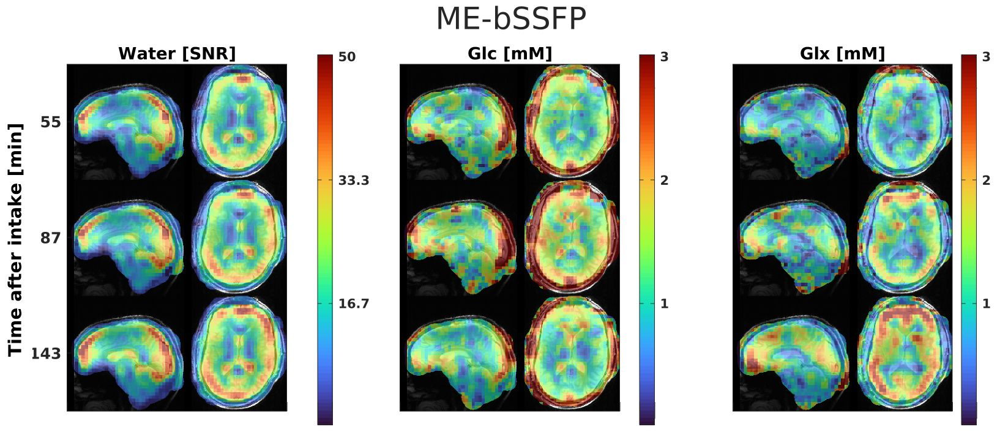

# DeuteMetCon

This MATLAB software repository is part of a human brain 3D deuterium metabolic imaging (DMI) work to investigate SNR improvement of bSSFP acquistion when using spectral-spatial CSI and multi-echo encoding schemes.

What can it do:

- reconstruct CSI and multi-echo raw data in SNR units
- multiple ways of spectral seperation 
    - CSI data (IDEAL,AMARES,Lorenztian fit, linear fitting)
    - multi-echo data (IDEAL, IDEAL-modes, linear fiting)
- in vivo metabolite quantification
- other utilities like NIFTI export, FLASH/FISP/bSSFP signal simulation, PSF calculation, etc
- non-localized T1/T2 spectroscopic Pulseq seqeunce and processing scripts



## Dependencies
- [mapVBVD](https://github.com/pehses/mapVBVD.git) : read Siemens raw data (required)
- [arrShow](https://github.com/btasdelen/arrShow.git) : Array Show for visualizing/debug (optional but highly recommended!)
- [Pulseq](https://github.com/pulseq/pulseq.git) : Only for spectroscopic Pulseq seqeunce and processing scripts (optional)
- [OXSA](https://github.com/OXSAtoolbox/OXSA.git) : Only for AMARES fitting (optional)
- [spm12](https://github.com/spm/spm12.git) : Only for reslicing (optional)

This package is developed on MATLAB 2022b
<details>
<summary>used toolboxes</summary>
1, MATLAB
2, Optimization Toolbox
3, Signal Processing Toolbox
4, Symbolic Math Toolbox
5, Image Processing Toolbox
6, Curve Fitting Toolbox
7, Parallel Computing Toolbox
8, Automated Driving Toolbox
9, Lidar Toolbox
10, Navigation Toolbox
11, Robotics System Toolbox
12, ROS Toolbox
13, UAV Toolbox

8-13: probably only required for dumb geometric tranformation for NIFTI export!

from `[fList, pList] = matlab.codetools.requiredFilesAndProducts('MetCon_CSI.m')`
</details>

## Installation

clone this repository and its dependencies.  
```
!git clone --depth=1 https://github.com/pehses/mapVBVD.git
!git clone --depth=1 https://github.com/praveenivp/DeutMeteCon.git
addpath(fullfile(pwd,'mapVBVD'))
addpath(genpath(fullfile(pwd,'DeutMeteCon')))

```
## Documentaion

Note that this repository is experimental, and for the most part, the code serves as its own documentation. Check out these demos to get a feel for what's going on, and then decide if diving into the code is worth your while.

The data required  for all demo scripts can be found in zenodo.org with [DOI:10.5281/zenodo.15864245](https://doi.org/10.5281/zenodo.15864245) 

- Demo 01 [[live script](./doc/demo01_CSI_phantom.mlx)][[PDF](./doc/demo01_CSI_phantom.pdf)] - CSI phantom data 
- Demo 02 [[live script](./doc/demo02_ME_phantom.mlx)][[PDF](./doc/demo02_ME_phantom.pdf)] - ME phantom data 
- Demo 03 [[live script](./doc/demo03_CSI_invivo.mlx)][[PDF](./doc/demo03_CSI_invivo.pdf)] - CSI invivo data 
- Demo 04 [[live script](./doc/demo04_ME_invivo.mlx)][[PDF](./doc/demo04_ME_invivo.pdf)] - ME invivo data 
- Demo 05 [[live script](./doc/demo05_NoiseTest.mlx)][[PDF](./doc/demo05_NoiseTest.pdf)] - Noise Test to verify

In case you want to reproduce the figures in the publication, please into the [Figure scripts folder](./scripts/figures). 


## Acknowledgements 
This package has unmodified/modified code from other sources. 
- adaptiveCombine.m is from  University of Wuerzburg, Germany
- wsvd coil combine is from Chris Rodgers, University of Oxford, 2014.
- noise decorrelation: [ismrm_sunrise_matlab](https://github.com/hansenms/ismrm_sunrise_matlab.git)
- some plot utilies are taken from matlab file exchange.
- Bruker data reader and other utils from Rolf Pohmann. 

The external softwares are bundled togther for easy testing of this repository. Please contact me if it violates any copyright.

## References:

1. IDEAL : Reeder SB, Wen Z, Yu H, et al. Multicoil Dixon chemical species separation with an iterative least-squares estimation method. Magn Reson Med. 2004;51(1):35-45. doi:10.1002/mrm.10675
2. AMARES : Vanhamme L, van den Boogaart A  null, Van Huffel S  null. Improved method for accurate and efficient quantification of MRS data with use of prior knowledge. J Magn Reson. 1997;129(1):35-43. doi:10.1006/jmre.1997.1244
3. adaptive coil combine: Walsh DO, Gmitro AF, Marcellin MW. Adaptive reconstruction of phased array NMR imagery. US Patent 6,160,398. 2000;690:682-690.  
4. WSVD coil combine: Rodgers CT, Robson MD. Receive array magnetic resonance spectroscopy: Whitened singular value decomposition (WSVD) gives optimal Bayesian solution. Magnetic Resonance in Medicine. 2010;63(4):881-891. doi:10.1002/mrm.22230

## How to Cite this
If you find this helpful for your work, please cite 

```
[pre-print](https://arxiv.org/abs/2501.18567) for now 
```

## Author
Comments and feedback to Praveen(praveen.ivp@gmail.com) 